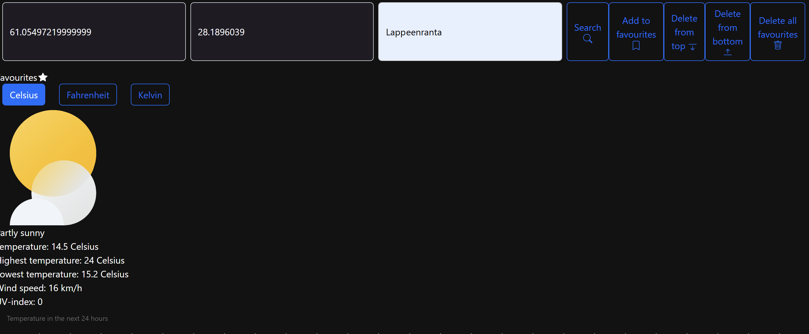
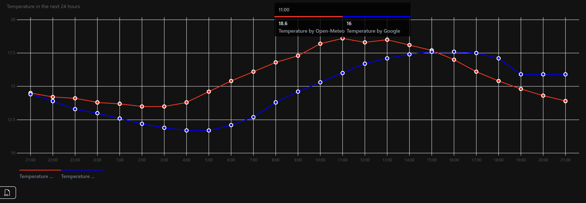
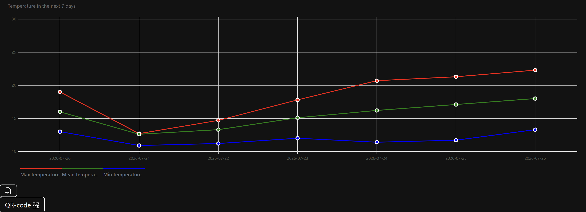
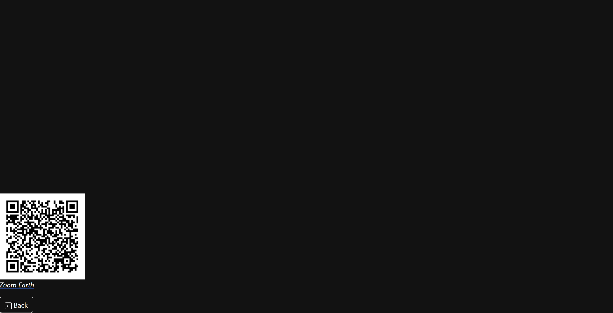

# Weather App

*Coursework project — CT30A2910 Introduction to Web Programming (Blended teaching, Lappeenranta/Lahti), LUT University, (autumn 2025)*

A browser-based weather application built as coursework for *Introduction to Web Programming*. Users can search for a location by coordinates or address, view current conditions plus 24-hour and 7-day forecasts as interactive charts, save favourite locations, and generate a shareable QR code for a location.

## Screenshots

<p align="center">
  <br>
  <br>
  <br>
  
</p>

## Features
 
- **Location search** — by latitude/longitude or by address (reverse/forward geocoding).
- **Current conditions** — temperature, description, wind speed, UV index, daily high/low.
- **Forecast charts** — 24-hour temperature (Open-Meteo vs. Google Weather) and 7-day min/mean/max temperature, rendered with [Frappe Charts](https://frappe.io/charts) and exportable as SVG.
- **Unit conversion** — toggle between Celsius, Fahrenheit, and Kelvin.
- **Favourites table** — save, and remove locations you've searched for.
- **Day/night styling** — background switches to a dark theme based on local sunrise/sunset time; during the day, the background color instead reflects the current temperature (e.g. blue for cold, red for hot — see [documentation](docs/documentation.pdf) for the full color scale).
- **QR code page** — generates a QR code linking to the searched location on [Zoom Earth](https://zoom.earth), with a rain/snow-style animated background based on current precipitation.

## Tech stack

- Vanilla HTML, CSS, and JavaScript (no build step or framework)
- [Bootstrap 5.2.1](https://getbootstrap.com/) for layout and styling
- [Frappe Charts](https://frappe.io/charts) for data visualization
- [qrcode.js](https://github.com/soldair/node-qrcode) for QR code generation

### External APIs

| API | Used for |
|---|---|
| [Google Weather API](https://developers.google.com/maps/documentation/weather/overview) | Current conditions & hourly forecast |
| [Google Geocoding API](https://developers.google.com/maps/documentation/geocoding) | Address ↔ coordinates lookup |
| [Open-Meteo](https://open-meteo.com/) | 24-hour temperature forecast |
| [MET Norway (met.no)](https://api.met.no/) | 7-day forecast |
| [sunrise-sunset.org](https://sunrise-sunset.org/api) | Sunrise/sunset time for day/night styling |

## Getting started

### Prerequisites

- A modern browser
- A local static server (e.g. VS Code's [Live Server](https://marketplace.visualstudio.com/items?itemName=ritwickdey.LiveServer) extension), since the app uses `fetch` and won't load correctly from a `file://` URL
- A Google Cloud API key with **both** the **Weather API** and **Geocoding API** enabled, and billing set up on the project (the Weather API is free during its Preview stage — see [Google's setup guide](https://developers.google.com/maps/documentation/weather/cloud-setup))

### Setup

1. Clone the repository:
   ```bash
   git clone https://github.com/thienantrieu/Introduction_to_Web_Programming_Project.git
   ```
2. In `basic.js`, replace `[INSERT_OWN_API_KEY]` in the `dataURL_current`, `dataURL_24hours_google`, `geodataURL`, and `r_geodataURL` variables with your own Google API key.
3. Serve the folder with a local server and open `index.html`.

> **Note:** Never commit a real API key to a public repository. For a real deployment, restrict the key (HTTP referrer) in the Google Cloud Console and/or load it from an environment variable via a small backend rather than embedding it in client-side code.

## Project structure

```
├── index.html      # Main app: search, current conditions, forecasts, favourites
├── basic.js         # App logic: fetching data, rendering, unit conversion
├── QR.html          # QR code page for the searched location
├── QR.js            # QR generation + animated canvas background
├── styles.css        # Custom styling (incl. dark mode overrides)
└── LICENSE          # MIT License
```

## Known limitations

- Requires a valid, correctly configured Google API key to function (see Setup above).
- Day/night styling is meant to reflect the user's own location and local time (so the app doesn't glare at night), but currently uses a hardcoded coordinate (Lappeenranta) instead of the user's real location — a proper implementation would use the browser's Geolocation API.

## Documentation

Full project documentation (features, tools/sources used, AI usage declaration) is available in [`docs/documentation.pdf`](docs/documentation.pdf).

## License

This project is licensed under the [MIT License](LICENSE).
